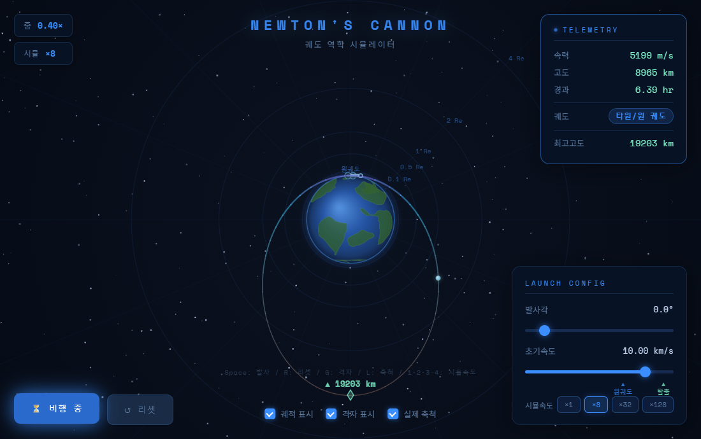
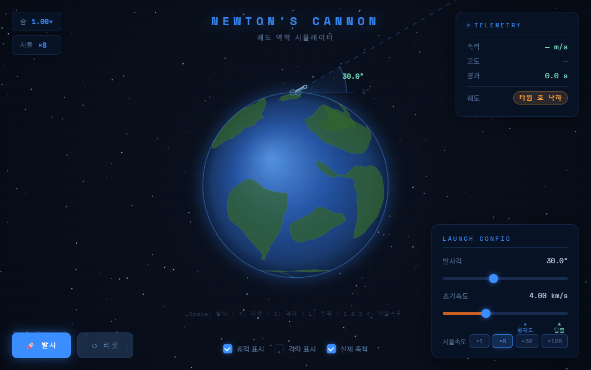
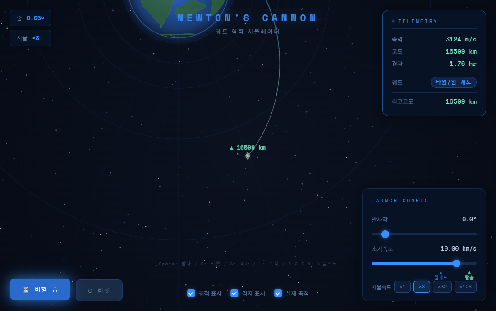
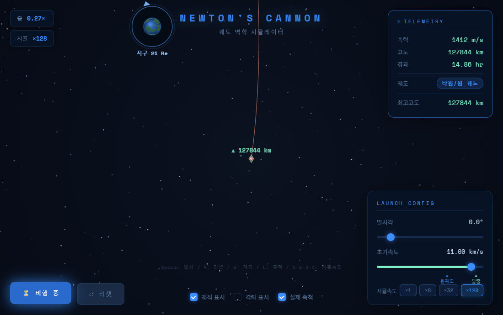
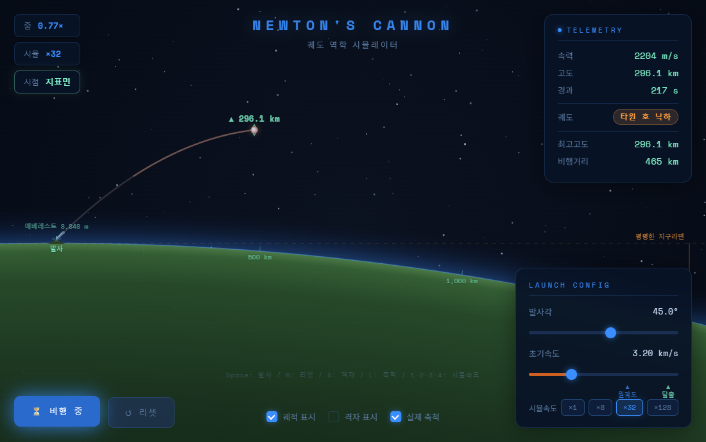
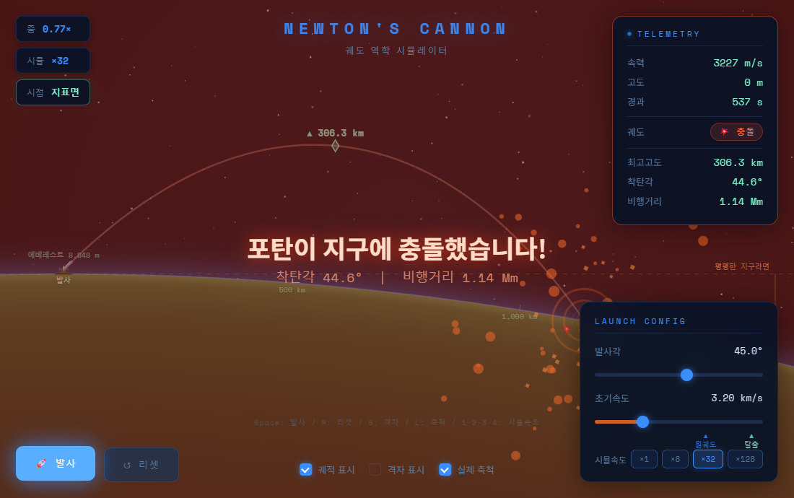
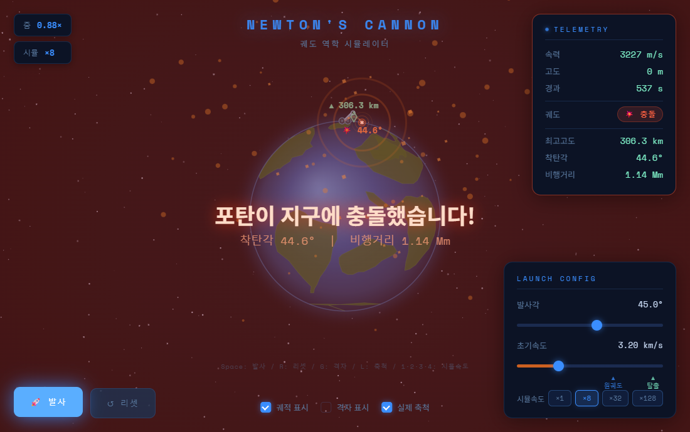
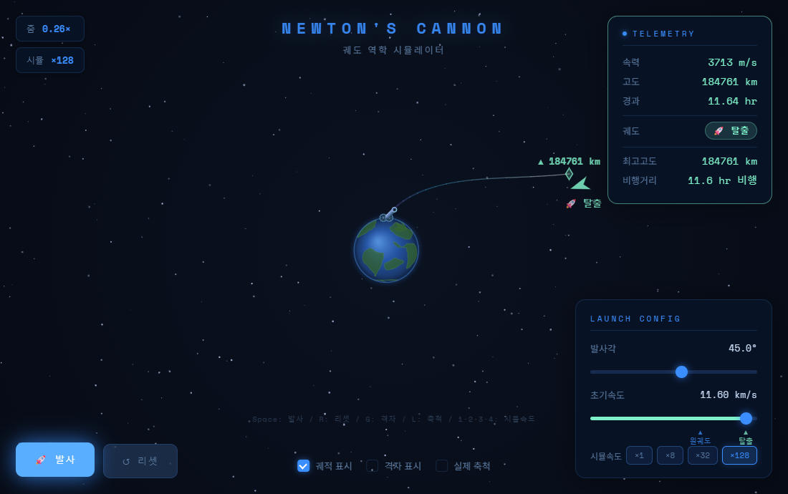
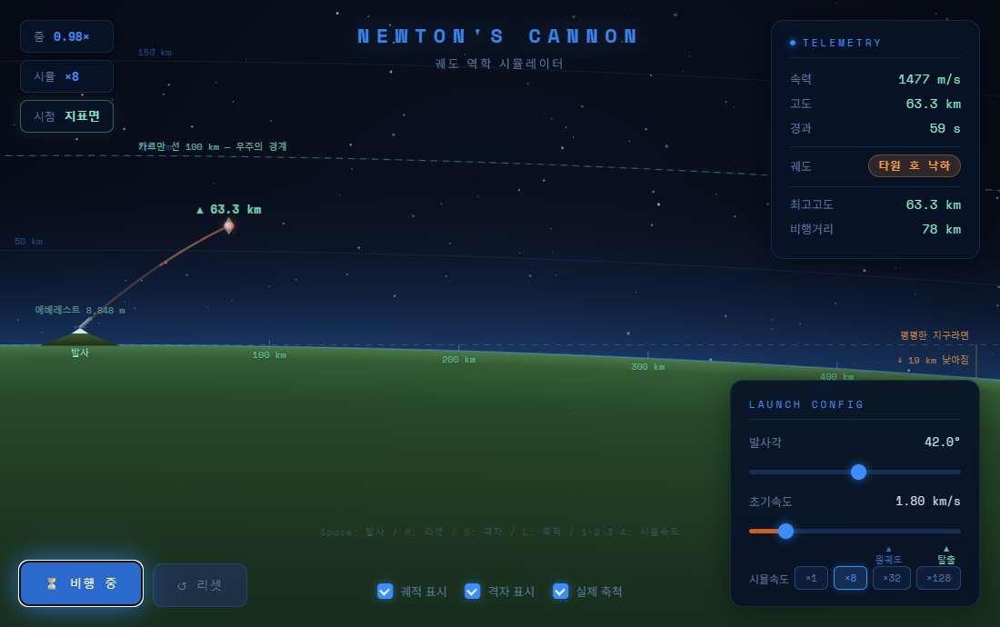
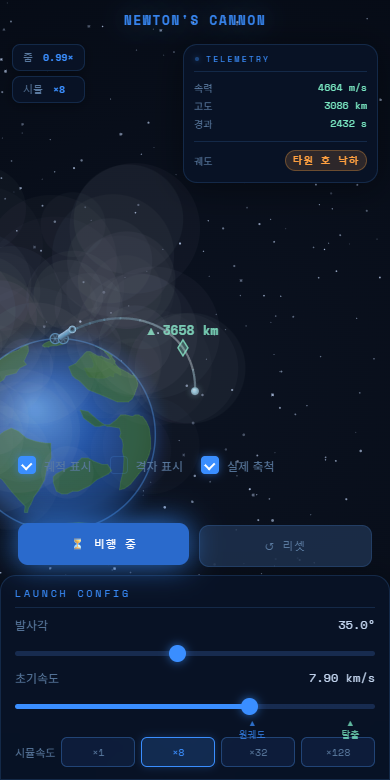

# 뉴턴의 대포 🚀

> **아주 높은 산 위에서 대포를 수평으로 쏘면 어떻게 될까?**
>
> 느리면 땅에 떨어집니다. 더 빠르면 더 멀리 떨어집니다.
> 그런데 충분히 빠르면 — 계속 떨어지면서도 영영 땅에 닿지 않습니다. 그것이 궤도입니다.

뉴턴이 남긴 이 유명한 사고실험(**Newton's cannonball**)을 직접 조작해 보는 웹 시뮬레이터입니다.
중력장 안에서의 운동, 제1·제2 우주속도, 케플러 궤도를 **슬라이더를 움직이며** 배웁니다.

### 👉 [**바로 실행하기**](http://shy.ai.kr/newton_cannon/)

설치·회원가입 없이 브라우저에서 바로 열립니다. PC·태블릿·스마트폰 모두 지원합니다.



---

## 5분 수업 도입

발사각은 그대로(0°) 두고 **초기속도만** 바꿔 이 순서대로 한 번씩 쏴 보세요.
속도 하나만으로 핵심이 다 나옵니다.

| 초기속도 | 무슨 일이 | 왜 |
|---|---|---|
| **2 km/s** | 약 430 km 날아가 떨어짐 | 중력이 이기는 구간 |
| **5 km/s** | 3,100 km 넘게 날아가 떨어짐 | 지면이 휘어 도망가지만 아직 부족 |
| **7.90 km/s** | 지면을 **아슬아슬하게 스치고** 추락 | 근지점이 지표면보다 4 km 낮음 — 딱 4 km 모자람! |
| **7.95 km/s** | 떨어지지 않고 **지구를 한 바퀴** (주기 86분) | 제1 우주속도(7,904 m/s) 돌파 |
| **9 km/s** | 고도 5,388 km까지 올라가는 **길쭉한 타원** | 원궤도보다 빨라 반대편으로 멀리 밀려남 |
| **11.2 km/s** | 돌아오지 않고 **떠남** | 제2 우주속도(탈출속도) |

속도 슬라이더 아래 ▲ 눈금 두 개가 **원궤도(7,904 m/s)** 와 **탈출(11,178 m/s)** 지점입니다.
슬라이더 색이 바뀌는 순간이 그 경계입니다. (주황 = 낙하 · 파랑 = 궤도 · 청록 = 탈출)

> 🔥 **7.90과 7.95 사이가 이 수업의 하이라이트입니다.**
> 7,900 m/s는 근지점이 지표면보다 **4 km** 낮아 아깝게 추락하고, 7,950 m/s는 궤도에 남습니다.
> 겨우 **50 m/s**(시속 180 km) 차이가 "떨어진다"와 "영원히 돈다"를 가릅니다.

---

## 두 개의 화면

발사 조건에 따라 **화면이 자동으로 바뀝니다.**

### 🌍 궤도 시점 — 지구 전체가 보이는 기본 화면



발사 전에는 대포의 조준선과 발사각이 보입니다. 궤도 주기는 90분이 넘기 때문에
시간은 **배속(×8 ~ ×128)** 으로 흐릅니다.

기본은 **실제 축척**입니다 — 화면의 타원은 수학 시간에 배운 그 타원이고,
**지구 중심이 초점**에 있습니다.

<table>
<tr>
<td width="50%"><br><sub>비행 중 — 카메라가 포탄을 따라가며 조금씩만 물러납니다</sub></td>
<td width="50%"><br><sub>지구가 화면 밖으로 나가면 — 지구 방향 가장자리에 둥근 창과 미니 지구, 거리(Re)</sub></td>
</tr>
</table>

비행 중에는 카메라가 **포탄을 따라갑니다.** 멀리 갈수록 조금씩 물러나지만(줌 ∝ 1/√거리)
궤도 전체를 한눈에 넣으려고 확 빠지지는 않습니다 — 지구가 뒤로 작아지고 하늘이 비어 가는
"떠나는 느낌"이 남도록 한 것입니다. 지구가 화면 밖으로 완전히 나가면 **지구가 있는 방향의
가장자리에 둥근 창**이 떠서 미니 지구와 지금 거리를 보여 줍니다. 한 바퀴를 다 돌면 지구를
가운데 두고 **타원 전체가 보이도록** 물러나고, 착탄·탈출로 끝나도 마찬가지입니다.

`L` 키(또는 **실제 축척** 체크 해제)로 **압축 보기**로 바꾸면 먼 곳을 로그 눈금으로 눌러
탈출 궤도까지 한 화면에 보이지만, 그 대신 **모양이 왜곡**됩니다(초점이 지구에서 벗어남).
수업에서 "이 궤적이 정말 타원인가"를 다룰 때는 반드시 실제 축척으로 보여 주세요.

### ⛰️ 지표면 시점 — 궤도를 못 도는 느린 발사일 때 자동 전환



궤도 시점에서는 "쏘자마자 땅에 박히는 짧은 선"으로 끝나 버리는 느린 발사를,
지표면에 붙어서 보여줍니다. 시간은 **실제 시간 기준**으로 흐르며(×1이면 1초 = 1초),
비행이 길면 화면에서 40초 안에 끝나도록 배속을 자동으로 맞춥니다.

여기서 중요한 것 — **지면은 평평한 직선이 아니라 실제 지구 곡률 그대로 휘어 있습니다.**
과장하지 않았습니다. 위 화면은 3.2 km/s 발사(사거리 1,143 km)인데,
착탄 지점의 지면은 발사 지점에서 그은 수평선보다 실제로 **26 km 아래**에 있습니다.
주황색 점선(`평평한 지구라면`)이 바로 그 수평선입니다.

포탄이 땅에 닿으면 **궤도 시점으로 돌아와 충돌 결과를 그대로 표시**합니다.

<table>
<tr>
<td width="50%"><br><sub>① 곡면 위에 착탄</sub></td>
<td width="50%"><br><sub>② 궤도 시점으로 복귀 — 충돌 이펙트·착탄각·비행거리 유지</sub></td>
</tr>
</table>

---

## 조작법

| 조작 | 하는 일 |
|---|---|
| **발사각** 슬라이더 (−10° ~ 90°) | 대포가 실시간으로 돌아갑니다 |
| **초기속도** 슬라이더 (0 ~ 12 km/s) | ▲ 눈금이 원궤도·탈출 속도 위치 |
| **🚀 발사** / `Space` `Enter` | 발사 |
| **↺ 리셋** / `R` | 처음으로 (궤도 시점으로 복귀) |
| **궤적 표시** / `T` | 지나온 길 표시 |
| **격자 표시** / `G` | 거리·고도 눈금 표시 |
| **실제 축척** / `L` | 켜면 실제 비율(타원이 정확한 타원), 끄면 압축 보기(먼 곳을 로그로 압축) |
| **시뮬속도** / `1` `2` `3` `4` | ×1 · ×8 · ×32 · ×128 |

> ⏱️ **시간에 대하여.** 물리는 언제나 **실제 시간 그대로** 계산됩니다 (×1이면 1초 = 1초).
> 다만 탄도 비행은 실제로 몇 분씩 걸리므로(4 km/s 발사 = **12분**), 지표면 시점은
> **비행 전체가 40초 안에 끝나도록 배속을 자동으로 골라** 줍니다.
> 짧은 비행은 ×1 리얼타임 그대로 재생되고, `1`을 누르면 언제든 실제 속도로 되돌릴 수 있습니다.

---

## 화면 읽는 법

### 텔레메트리 패널 (우측 상단)

| 항목 | 뜻 |
|---|---|
| **속력** | 현재 속력. 근지점에서 빨라지고 원지점에서 느려집니다 |
| **고도** | 지표면 기준 높이 |
| **경과** | 발사 후 흐른 **시뮬레이션 시간** (실제 시간 아님) |
| **궤도** | 지금 상태의 궤도 종류 — 패널 테두리 색도 함께 바뀝니다 |
| **최고고도 / 착탄각 / 비행거리** | 비행 통계 |

**궤도 배지**는 속력만 보지 않고 그 순간의 **위치·속도로 궤도 요소**를 구해 판정합니다.
에너지가 양수면 `탈출 궤도`, 음수인데 근지점이 지표 위면 `타원/원 궤도`,
근지점이 지표 아래(= 언젠가 땅에 닿음)면 `타원 호 낙하` 입니다.
탈출 판정도 거리가 아니라 **에너지 부호**로 합니다 — 탈출속도 바로 아래(예: 11.15 km/s, 원지점 약 194 Re)
로 쏘면 수십 일이 걸리더라도 반드시 돌아오고, 에너지가 양수인 포탄만 30 Re 를 넘는 순간 `탈출`로 끝납니다.
그래서 같은 속력이라도 발사각을 올리면 배지가 `타원/원 궤도` → `타원 호 낙하` 로 바뀝니다.

> 왜 "포물선"이 아니라 "타원 호"인가 — 공기 저항이 없는 점질량 중력장에서 궤적은 언제나
> **지구 중심을 초점으로 하는 원뿔곡선**입니다. 땅에 떨어지는 포탄도 타원의 일부(호)를 그리며,
> 교과서의 포물선은 "지표 근처에서 중력이 평행하다"는 근사입니다. 지표면 시점이 바로 그 차이를 보여줍니다.

### 궤적의 색 = 그 순간의 속력


<br><sub>탈출 궤도 — 먼 우주를 로그 눈금으로 압축하는 `L` 압축 보기로 찍은 화면 (30 Re 를 넘는 순간 탈출로 끝남)</sub>

느림 **주황** → 원궤도 **청록** → 탈출 **보라**.
타원 궤도에서 근지점 쪽이 밝고 원지점 쪽이 어두워지는 것을 보면 **속력이 변한다**는 걸 눈으로 알 수 있습니다.

### 마커

- ◆ **▲ 최고고도** — 궤적에서 가장 높이 올라간 지점(원지점)
- ✕ **💥 착탄각** — 떨어진 지점과 지표면 법선 기준 입사각
- ➤ **🚀 탈출** — 지구를 벗어난 방향

---

## 수업에서 이렇게 써 보세요

### 활동 1. 제1 우주속도를 직접 찾아내기 `기초`

> **발문** — "떨어지지 않고 지구를 한 바퀴 도는 최소 속도는 얼마일까?"

발사각 0°로 두고 속도를 **50 m/s씩** 올리며 처음으로 한 바퀴를 완주하는 값을 찾게 합니다.

| 초기속도 | 근지점 고도 | 결과 |
|---|---|---|
| 7,850 m/s | −163 km | 추락 |
| 7,900 m/s | **−4 km** | 아슬아슬하게 추락 |
| 7,950 m/s | +8.8 km | **궤도 유지** (주기 86분) |

- 학생이 찾는 답: **7,950 m/s**
- 이론값: $v=\sqrt{GM/r}$ — 발사 고도(에베레스트 8,848 m) 기준 **7,904 m/s**
- 지표면 기준으로 계산하면 **7,910 m/s** 입니다. 두 값이 다른 이유(발사 고도가 높으면
  중력이 약해 더 느려도 된다)를 묻는 것이 좋은 후속 발문입니다.

> 🔎 **왜 딱 7,904를 맞출 수 없을까?** 슬라이더 눈금이 50 m/s이기 때문입니다.
> "측정 도구의 분해능보다 정밀한 값은 읽을 수 없다"는 이야기로 자연스럽게 이어집니다.

### 활동 2. 최대 사거리를 만드는 발사각은 정말 45°일까? `심화` ⭐

> **발문** — "교과서에서는 45°가 최대 사거리라고 배웠는데, 여기서도 그럴까?"

**속도를 4~5 km/s로 크게 잡고** 발사각만 0.5°씩 바꿔 가며 사거리를 기록하게 합니다.

| 초기속도 | 최대 사거리 발사각 | 그때 사거리 | 45°일 때 | 차이 |
|---|---|---|---|---|
| 1 km/s | 43° | 111 km | 111 km | **0 km** |
| 2 km/s | 43.5° | 431 km | 430 km | 1 km |
| 3 km/s | 42.5° | 1,000 km | 996 km | 4 km |
| 4 km/s | 41° | 1,889 km | 1,867 km | 22 km |
| 5 km/s | **37.5°** | 3,233 km | 3,132 km | **101 km** |

두 가지가 동시에 보입니다.

1. **빠를수록 최적각이 작아집니다** (43° → 37.5°).
2. **느릴 때는 45°가 맞습니다.** 1 km/s에서는 차이가 아예 없습니다.

왜 그럴까요? 교과서의 45°는 ① 지면이 평평하고 ② 중력이 어디서나 같다는 가정에서 나옵니다.
사거리가 100 km쯤이면 그 가정이 충분히 좋고, 3,000 km가 되면 무너집니다.
**지표면 시점의 `평평한 지구라면` 점선이 바로 ①번 가정이 언제 깨지는지를 보여줍니다.**

> 💡 근사가 "틀렸다"가 아니라 **"어디까지 쓸 수 있는가"** 를 다루는 활동입니다.

### 활동 3. 에너지는 보존되는가 `심화`

타원 궤도(예: 9 km/s, 0°)를 쏘고 궤적 색과 텔레메트리를 함께 관찰합니다.

> **발문** — "높이 올라가면 느려지고 내려오면 빨라진다. 어디서 온 에너지일까?"

최고고도 지점과 근지점의 속력을 기록해 $\frac12 v^2 - \frac{GM}{r}$ 이 일정한지 확인시킵니다.

### 활동 4. 지구는 정말 둥근가 `측정`



지표면 시점에서 `격자 표시`를 켜면 **평평한 지구라면 지면이 얼마나 높았을지** 수치로 나옵니다.

> **발문** — "1,000 km 떨어진 곳의 바다는 나보다 얼마나 낮을까?"

낙차는 $d^2/2R$ 로 근사됩니다 ($R$ = 지구 반지름 6,371 km).
사거리를 바꿔 가며 측정하고 계산값과 비교하게 하세요.

| 떨어진 거리 | 지면이 낮아지는 정도 |
|---|---|
| 10 km | 약 8 m |
| 100 km | 약 0.8 km |
| 1,000 km | 약 79 km |

10 km 앞바다가 8 m 낮다는 것 — 그래서 해변에서는 지구가 평평해 보입니다.

### 활동 5. 카르만 선 넘기기 `연계`

격자를 켜면 고도 **100 km**에 `카르만 선 — 우주의 경계` 가 표시됩니다.

> **발문** — "우리 대포알은 '우주에 갔다'고 할 수 있을까? 그런데 왜 궤도에 남지 못했을까?"

**우주에 도달하는 것(고도)** 과 **궤도에 남는 것(속도)** 이 전혀 다른 문제라는 걸 짚어 주는 활동입니다.
실제 준궤도 관광 비행(고도 100 km 돌파, 그러나 즉시 낙하)이 바로 이 상황입니다.

---

## 관련 단원

| 과목 | 연결되는 내용 |
|---|---|
| 물리학Ⅰ · 통합과학 | 힘과 운동, 포물선 운동, 역학적 에너지 보존 |
| **물리학Ⅱ** | **만유인력, 등속 원운동, 케플러 법칙, 인공위성과 우주속도** |
| 지구과학Ⅰ | 지구의 크기와 모양, 인공위성 궤도 |
| 융합·창의 | 우주 개발, 준궤도 비행, 탄도 미사일의 물리 |

---

## 이 시뮬레이터가 단순화한 것

수업에서 **반드시 함께 짚어 주세요.** 오히려 좋은 발문 소재가 됩니다.

| 단순화 | 실제라면 |
|---|---|
| **공기 저항 없음** | 저속 발사는 훨씬 일찍 떨어집니다. 실제 대포알로는 궤도에 못 갑니다 |
| **지구 자전 없음** | 동쪽으로 쏘면 자전 속도(적도 기준 약 465 m/s)를 덤으로 얻습니다 |
| **2차원 평면** | 실제 궤도는 3차원이고 궤도면 경사가 있습니다 |
| **포탄 질량 무관** | 맞습니다 — 중력 가속도는 질량과 무관하므로 **의도된 정확한 표현**입니다 |
| **지구는 완전 구·균질** | 실제 지구는 약간 납작하고 밀도가 고르지 않아 궤도가 서서히 틀어집니다 |
| 압축 보기(`L` 끔)에서 산 높이 8배 과장 | 8,848 m는 지구 반지름의 0.14%라 실제 비율로는 보이지 않습니다. **실제 축척(기본)과 지표면 시점에서는 실제 비율**로 그립니다 |

> 🔬 **물리 검증.** `npm run verify:physics` 가 17가지 발사각·속도 조합에 대해 시뮬레이터 궤적을
> 해석적 원뿔곡선 `r(θ) = p / (1 + e·cos(θ − ω))` 과 비교합니다. 타원·포물선·쌍곡선 모두
> 반지름 상대오차 **10⁻⁴ 이내**(에너지·각운동량 드리프트 10⁻⁶ 이하)이고, 실제 축척 화면에서도
> 0.2% 이내로 같은 곡선입니다. 압축 보기는 설계상 25% 정도 벗어납니다(그래서 기본이 아닙니다).

> 💬 **좋은 발문** — "공기 저항이 있다면 이 시뮬레이션은 어떻게 달라질까? 그래서 실제 로켓은 왜 수직으로 올라갔다가 옆으로 눕는 걸까?"

---

## 스마트폰에서도 됩니다



세로·가로 모드 모두 지원합니다. 학생 개인 기기로 각자 탐구하게 하기 좋습니다.
링크만 공유하면 됩니다 → http://shy.ai.kr/newton_cannon/

---

## 자주 묻는 질문

**Q. 인터넷 없이 쓸 수 있나요?**
한 번 열어 두면 창을 닫기 전까지는 동작합니다. 다만 파일을 내려받아 `index.html`을
더블클릭하면 **동작하지 않습니다**(브라우저 보안 정책). 아래 *직접 실행하기*를 참고하세요.

**Q. 왜 어떤 발사는 화면이 바뀌나요?**
① 궤도를 완주하지 못하고 반드시 땅에 떨어지며 ② 사거리가 3,800 km 이하인 발사가
지표면 시점으로 갑니다. 45° 발사 기준으로 대략 **5.4 km/s 미만**입니다.
이런 발사는 지구 전체 화면에서 보면 너무 짧아 아무것도 안 보이기 때문입니다.

**Q. 시간이 너무 오래 걸려요 / 너무 빨라요.**
지표면 시점은 비행시간에 맞춰 배속을 자동으로 고릅니다(화면에서 40초 이내).
시뮬속도 버튼(`1`·`2`·`3`·`4`)으로 언제든 바꿀 수 있고, `1`이 실제 시간 그대로입니다.

**Q. 슬라이더를 더 정밀하게 맞추고 싶어요.**
발사각은 0.5°, 초기속도는 50 m/s 단위입니다. 슬라이더를 클릭한 뒤
**방향키 ←/→** 를 누르면 한 눈금씩 정확하게 움직일 수 있습니다.

**Q. 수업 자료로 마음대로 써도 되나요?**
네. 수정·배포·재사용 모두 자유롭게 하셔도 됩니다.

---

## 직접 실행하기 / 고쳐 쓰기

```bash
git clone https://github.com/sehunYang/newton_cannon.git
cd newton_cannon
npm run dev          # → http://localhost:5173
```

> ⚠️ `index.html`을 더블클릭해 `file://`로 열면 동작하지 않습니다.
> 브라우저가 보안상 ES 모듈 로드를 차단하기 때문입니다. 위 명령이나 VS Code Live Server를 쓰세요.

수업에 맞게 바꾸고 싶은 값들:

| 바꾸고 싶은 것 | 파일 |
|---|---|
| 중력 상수, 행성 반지름·질량 (달·화성 버전!) | `src/core/constants.js` |
| 색상 팔레트 | `styles/tokens.css` |
| 속도 슬라이더 범위 | `src/core/constants.js` 의 `SPEED_SLIDER_MAX` |
| 지표면 시점으로 전환되는 범위 | `src/core/constants.js` 의 `SURFACE_MAX_ARC` |
| 지표면 시점 자동 배속 (기본 40초) | `src/app/modes/SurfaceMode.js` 의 `MAX_WALL_SECONDS` |
| 슬라이더 눈금 | `index.html` 의 `step` 속성 |

검증:

```bash
npm run check         # 모든 모듈 로드 확인
npm test              # 물리·배선·라우팅 47개 검사
npm run test:browser  # 실제 Chrome E2E 89개 검사 + 스크린샷
```

구조와 설계 의도는 **[ARCHITECTURE.md](ARCHITECTURE.md)** 에 정리돼 있습니다.

---

<sub>만든이 · 양세훈 | 교실에서 자유롭게 쓰세요</sub>
